# June

  

  <strong>An open-source alternative to Pixel Journal</strong> 
  Built with Jetpack Compose and Material Design 3

    
    

  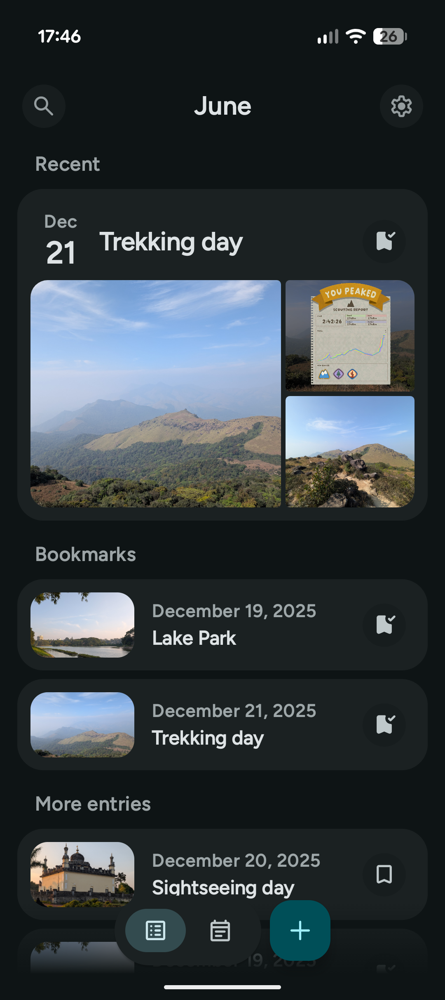
  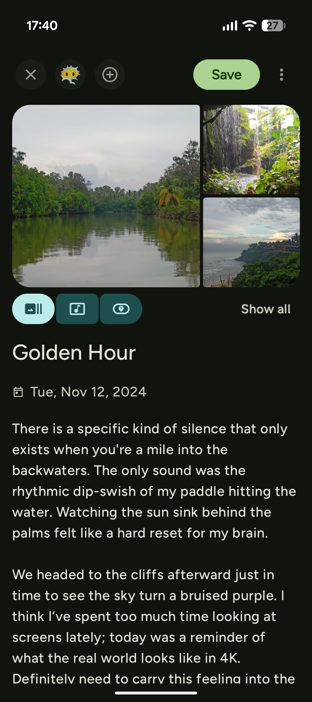
  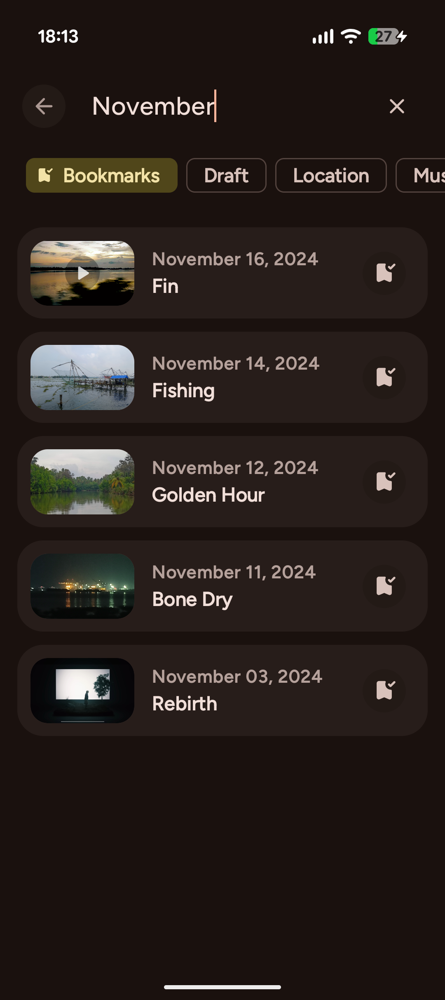
  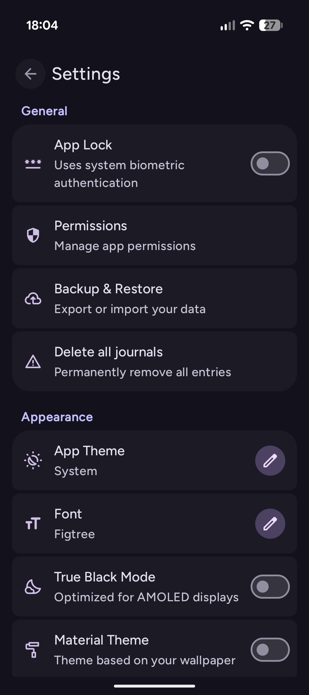
  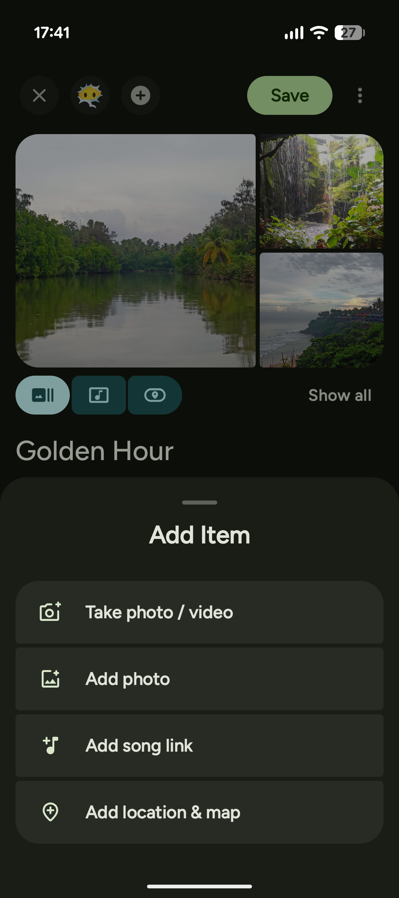
  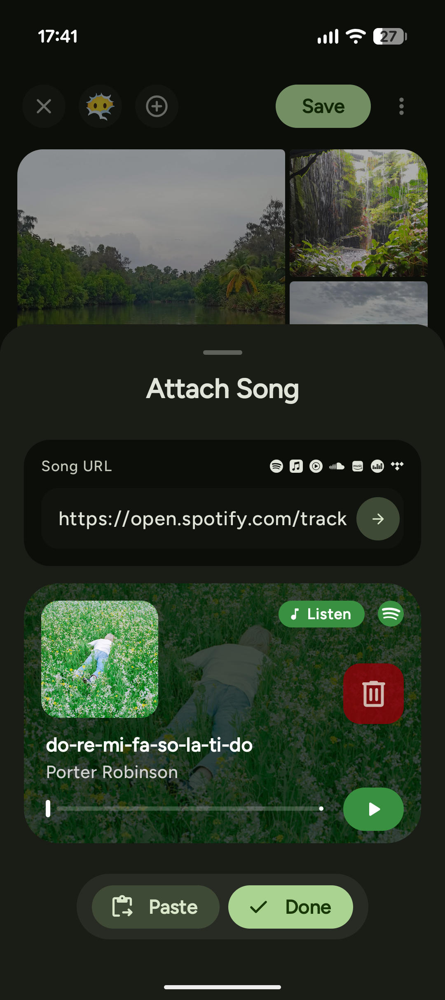
  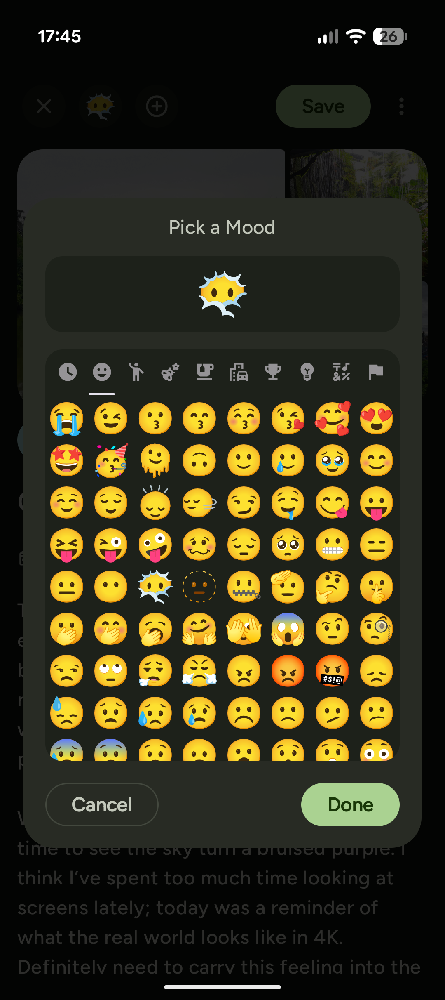
  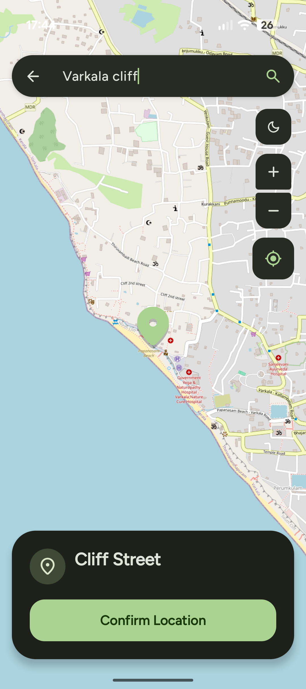
  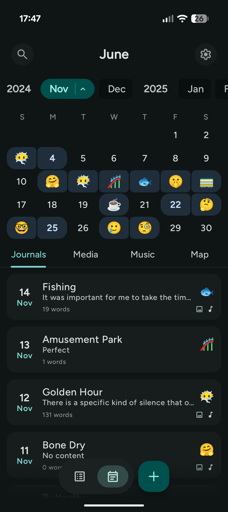
  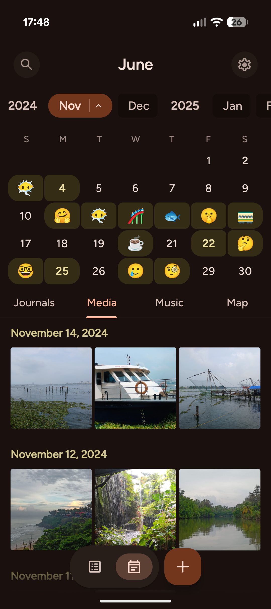
  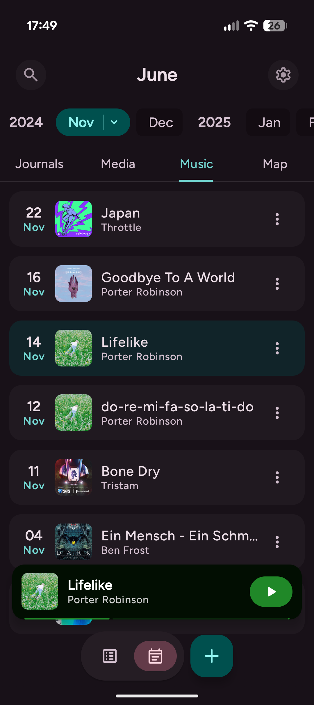
  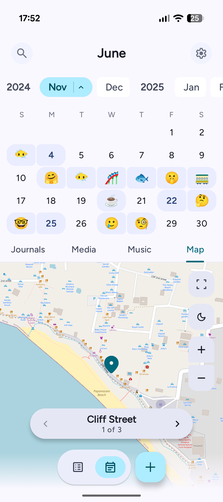

## Core Features

June is designed to be more than just text, it's a multimedia capsule of your life.

### Capture Every Detail

- **Multimedia Capsules:** Go beyond words by attaching **photos**, **songs** and **maps** to any entry.
- **Soundtrack Support:** Paste a link from Spotify or Apple Music, and June automatically fetches the cover art and details.
- **Mood Tracking:** Tag entries with emojis to log your emotional journey over time.

### Relive Your History

- **Fluid Timeline:** Navigate your past via a smooth month-strip or browse the dedicated **Media Gallery**.
- **Visual Habits:** Keep your momentum going with calendar streaks and writing indicators.
- **Smart Search:** Instantly locate memories by content, date, tags, or attached media.

### Secure & Styled

- **Biometric Vault:** Protect your private thoughts with Fingerprint or Face Unlock.
- **Expressive Theming:** Dynamic Wallpaper Colors or Custom Themes for a personalized look.
- **Total Ownership:** 100% offline architecture with full Backup & Restore capabilities.

## Tech Stack

June is built with modern Android development practices, leveraging **Jetpack Compose** and **Kotlin**.

### Architecture & Core

- **Language:** [Kotlin](https://kotlinlang.org/) (100%)
- **UI Toolkit:** [Jetpack Compose](https://developer.android.com/jetpack/compose) (Material 3)
- **Architecture:** MVVM (Model-View-ViewModel) with Clean Architecture principles.
- **Dependency Injection:** [Koin](https://insert-koin.io/)
- **Navigation:** [Jetpack Navigation Compose](https://developer.android.com/guide/navigation/navigation-compose)
- **Asynchronous:** Coroutines & Flows

### Data & Networking

- **Local Database:** [Room](https://developer.android.com/training/data-storage/room) (SQLite abstraction)
- **Preferences:** [Jetpack DataStore](https://developer.android.com/topic/libraries/architecture/datastore)
- **Networking:** [Retrofit](https://square.github.io/retrofit/) & [OkHttp](https://square.github.io/okhttp/)

### UI & Media

- **Image Loading:** [Coil](https://coil-kt.github.io/coil/)
- **Video/Audio:** [Media3 (ExoPlayer)](https://developer.android.com/media/media3)
- **Maps:** [OSMDroid](https://github.com/osmdroid/osmdroid) (OpenStreetMap)
- **Theming:** [MaterialKolor](https://github.com/jordond/MaterialKolor) (Dynamic Material You colors)
