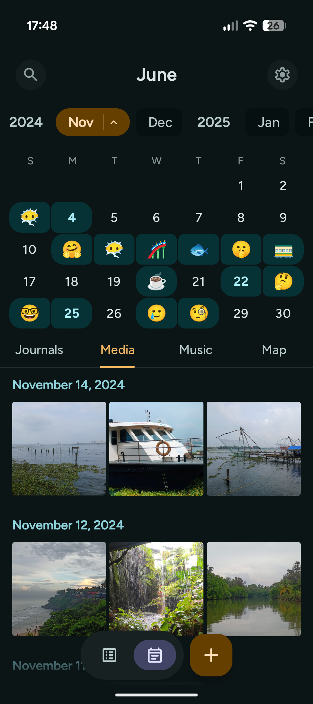
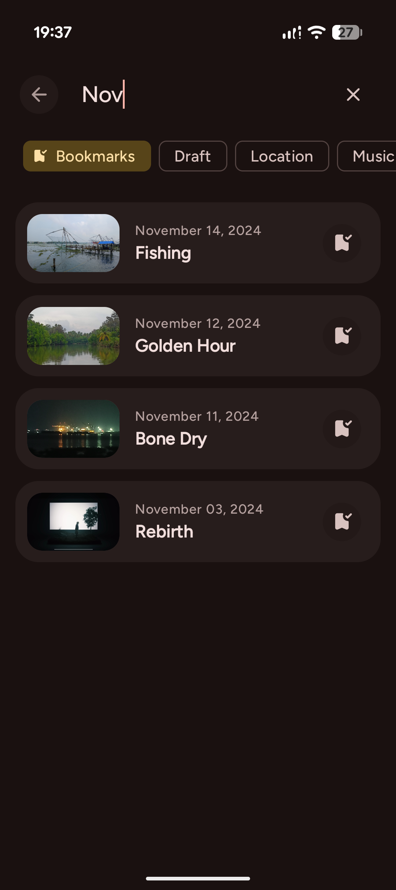

# June

<p align="center">
  
</p>

<p align="center">
  <strong>An open-source alternative to Pixel Journal</strong><br>
  Built with Jetpack Compose and Material Design 3
</p>

<p align="center">
    <a href="https://github.com/DenserMeerkat/June/releases/latest">
        
    </a>
    <a href="https://github.com/DenserMeerkat/June/releases">
        
    </a>
    <a href="https://github.com/DenserMeerkat/June/releases">
        
    </a>
</p>

<p align="center">
  
  
  
  
  
  
  
  
</p>

## Core Features

June is designed to be more than just text—it's a multimedia capsule of your life.

### Capture Every Detail

- **Multimedia Capsules:** Go beyond words by attaching **photos**, **videos**, and **precise locations** to any entry.
- **Soundtrack Support:** Paste a link from any major streaming platform (Spotify, Apple Music, etc.), and June automatically fetches the cover art and song details.
- **Mood Tracking:** Tag entries with emojis to log your emotional journey and personal growth over time.

### Relive Your History

- **Unified Timeline:** Navigate your past via a smooth month-strip. See your **media, songs, and locations** all in one place within a seamless flow.
- **Visual Habits:** Keep your momentum going with calendar **streaks** and writing indicators that visualize your consistency.
- **Smart Search:** Instantly locate memories by searching through content, dates, tags, or attached media.

### Secure & Styled

- **Biometric Vault:** Protect your private thoughts with Fingerprint or Face Unlock.
- **Expressive Theming:** Enjoy a personalized look with **Dynamic Wallpaper Colors (Material You)** or curated custom themes.
- **Total Ownership:** 100% offline architecture with full Backup & Restore capabilities—your data never leaves your device.

## Tech Stack

June is built with modern Android development practices, leveraging **Jetpack Compose** and **Kotlin**.

### Architecture & Core

- **Language:** [Kotlin](https://kotlinlang.org/) (100%)
- **UI Toolkit:** [Jetpack Compose](https://developer.android.com/jetpack/compose) (Material 3)
- **Architecture:** MVVM (Model-View-ViewModel) with Clean Architecture principles.
- **Dependency Injection:** [Koin](https://insert-koin.io/)
- **Navigation:** [Jetpack Navigation Compose](https://developer.android.com/guide/navigation/navigation-compose)
- **Asynchronous:** Coroutines & Flows

### Data & Networking

- **Local Database:** [Room](https://developer.android.com/training/data-storage/room) (SQLite abstraction)
- **Preferences:** [Jetpack DataStore](https://developer.android.com/topic/libraries/architecture/datastore)
- **Networking:** [Retrofit](https://square.github.io/retrofit/) & [OkHttp](https://square.github.io/okhttp/)

### UI & Media

- **Image Loading:** [Coil](https://coil-kt.github.io/coil/)
- **Video/Audio:** [Media3 (ExoPlayer)](https://developer.android.com/media/media3)
- **Maps:** [MapLibre](https://maplibre.org/) & [MapTiler](https://www.maptiler.com/) (Vector-based rendering)
- **Theming:** [MaterialKolor](https://github.com/jordond/MaterialKolor) (Dynamic Material You colors)

## Building Locally

To set up June on your local machine, follow these steps:

### 1. Prerequisites

- **Android Studio:** Latest stable version recommended.
- **JDK 17:** The project is configured to use Java 17 toolchain.

### 2. Clone the Repository

```bash
git clone https://github.com/DenserMeerkat/June.git
cd June
```

### 3. Configure API Keys

June uses **MapTiler** for map rendering.

1.  Get a free API key from [MapTiler Cloud](https://cloud.maptiler.com/).
2.  Copy the `local.properties.example` file to `local.properties`:
    ```bash
    cp local.properties.example local.properties
    ```
3.  Open `local.properties` and replace the placeholder with your key:
    ```properties
    MAPTILER_API_KEY=your_actual_key_here
    ```

### 4. Build & Run

1. Open the project in Android Studio and let Gradle sync.
2. Select the debug build variant (default).
3. Click Run.
   > Note: You do not need `keystore.properties` to build the debug version. That file is only required for signing release/beta builds.
